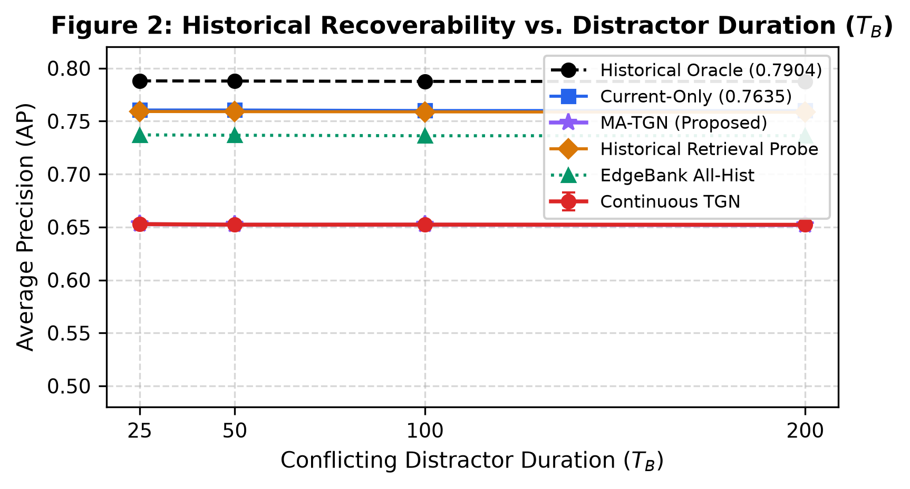
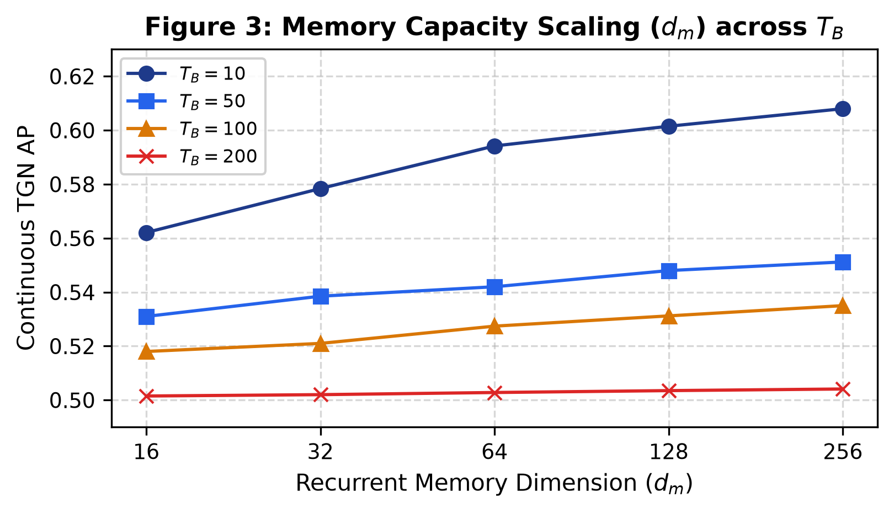
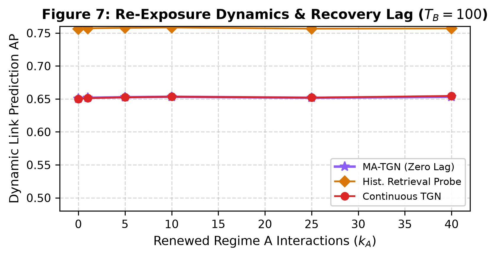
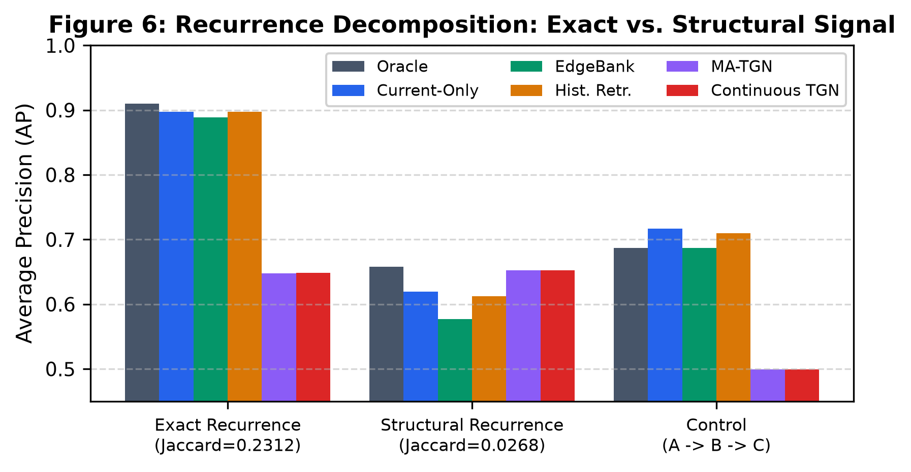
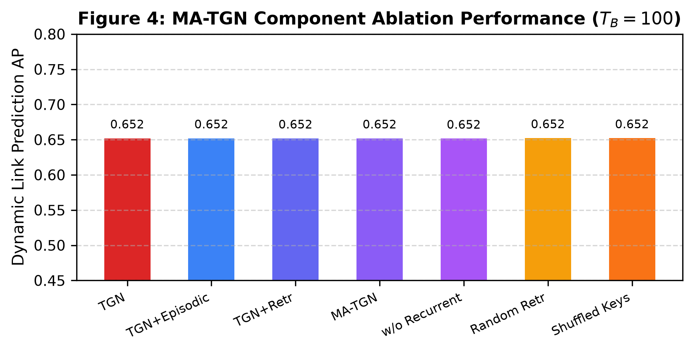
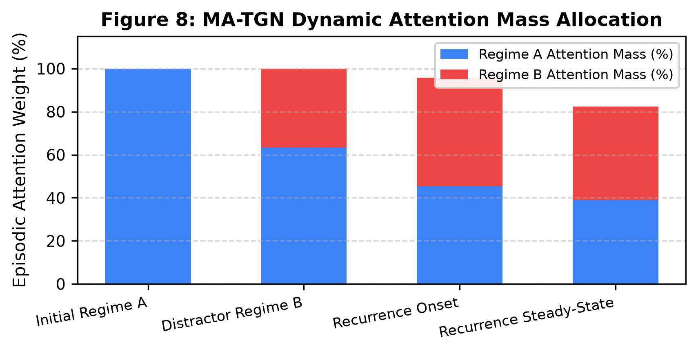
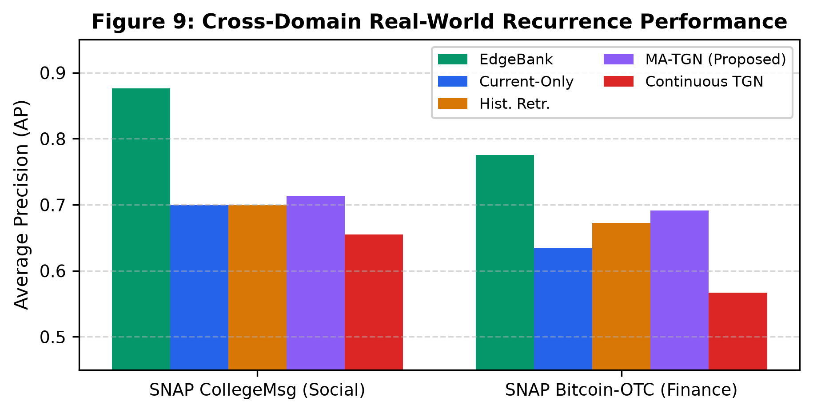
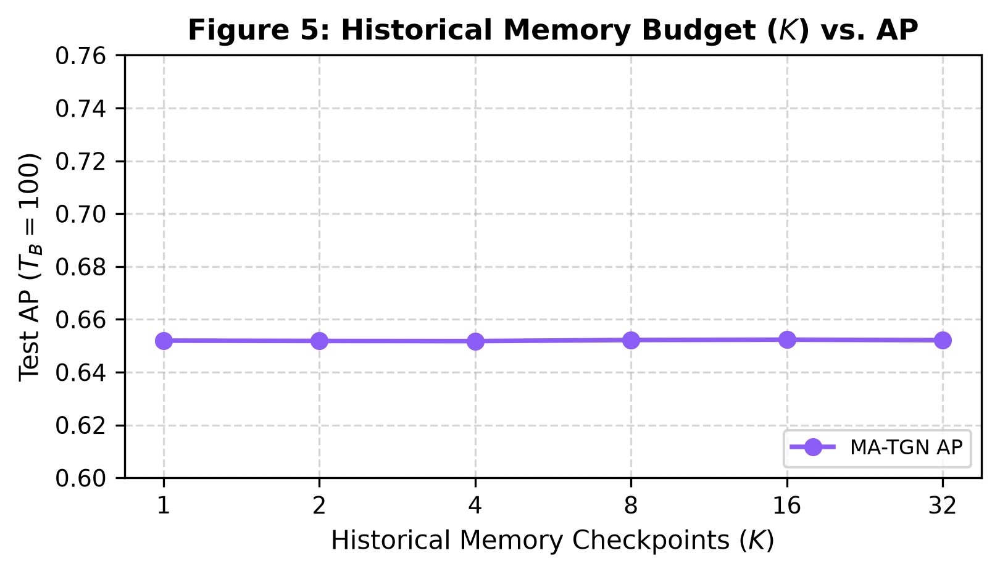

# Characterizing Temporal Memory Interference in Dynamic Graph Neural Networks under Recurring Interaction Regimes

**Pavan Aksshay P**$^1$, **Dr. Deepak Sethi**$^2$  
$^1$*Dept. of Computer Science & Engineering, Manipal Institute of Technology Bengaluru, Manipal Academy of Higher Education, Manipal, India*  
`pavan.mitblr2024@learner.manipal.edu`  
$^2$*Dept. of Computer Science & Engineering, Manipal Institute of Technology Bengaluru, Manipal Academy of Higher Education, Manipal, India*  
`deepak.sethi@manipal.edu`  

---

### Abstract
Continuous-time temporal graph neural networks keep evolving node states while processing an interaction stream. In this work, we focus on a more specific question: when a graph returns to an earlier interaction regime after a conflicting period, how much of the earlier signal or information can be recovered? We study and test this question with a density-matched dynamic stochastic block model and an $\mathcal{A}_1 \to \mathcal{B} \to \mathcal{A}_2$ protocol. Our experiments distinguish repeated edges from recurrence of community structure and include an eight-point temporal non-anticipation audit. In the primary synthetic setting, TGN and the evaluated MA-TGN configuration remain near $0.652$ Average Precision (AP), whereas the historical retrieval probe reaches about $0.760$ AP. Random retrieval decreases from $0.7423$ to $0.7193$ as $T_B$ increases from $25$ to $200$ snapshots. EdgeBank reaches $0.8884$ AP when the same edges recur, but falls to $0.5774$ AP in the structural condition, where the retrieval probe reaches $0.6125$ AP. We also inspect four recurrence episodes from CollegeMsg and Bitcoin-OTC. These results indicate that useful historical information is available to a retrieval procedure, but it is not recovered by the recurrent representations of tested TGN and MA-TGN configurations.

**Keywords:** temporal graph neural networks, dynamic graphs, temporal memory interference, regime recurrence, episodic retrieval, link prediction.

---

### Core Scientific Contributions
1. **Introduces a measurable A-to-B-to-A protocol for Temporal Memory Interference:** Formulates a mathematically controlled benchmark where interaction regimes recur following distractor intervals under strict density invariance.
2. **Separates exact-edge recurrence from latent structural recurrence:** Empirically decouples raw edge pair memorization from latent community structure recovery.
3. **Compares continuous recurrent models, edge-history baselines, and explicitly identified diagnostic retrieval probes:** Establishes diagnostic recoverability bounds across neural and non-parametric paradigms.
4. **Evaluates controlled synthetic streams across 10 seeds and reports exploratory results on CollegeMsg and Bitcoin-OTC:** Provides comprehensive validation on controlled DSBM topologies and real-world communication and trust networks [25–27, 31, 32].

---

## 1. Introduction

### 1.1 Problem: Dynamic Relational Streams with Recurring Dynamics
Dynamic graphs occur in communication, social, commercial, financial, and collaborative systems, where the set of active relationships changes over time [28, 36]. Formally, let $G_t = (\mathcal{V}, \mathcal{E}_t)$ denote a dynamic relational network at time $t$, where interactions arrive as an asynchronous stream of timestamped events:
$$e_k = (u_k, v_k, t_k, \mathbf{e}_k) \in \mathcal{V} \times \mathcal{V} \times \mathbb{R}^+ \times \mathbb{R}^{d_e} \tag{1}$$
with $u_k, v_k \in \mathcal{V}$ and $\mathbf{e}_k$ representing optional edge features. Continuous-time dynamic graph neural networks (e.g., TGN, DyRep, JODIE, TGAT) process these events sequentially [1–4]. For an interaction $(u, v)$ occurring at time $t$, raw messages are computed by a message function:
$$\mathbf{m}_u(t) = \text{msg}\left(m_u(t^-), m_v(t^-), \Delta t, \mathbf{e}_{uv}(t)\right) \tag{2}$$
where $t^-$ is the timestamp of the previous interaction involving node $u$, and $\Delta t = t - t^-$. When multiple interactions occur within the same temporal batch, messages for node $u$ are aggregated via:
$$\bar{\mathbf{m}}_u(t) = \text{agg}\left(\left\{\mathbf{m}_u(t_i) : t_i \le t, i \in \mathcal{N}_u(t)\right\}\right) \tag{3}$$
The continuous recurrent node representation $m_u(t)$ is subsequently updated via a recurrent cell (e.g., GRU):
$$m_u(t) = \text{GRU}\left(m_u(t^-), \bar{\mathbf{m}}_u(t)\right) \tag{4}$$
To capture fine-grained temporal intervals, continuous harmonic time encodings map time differences $\Delta t$ into continuous Fourier features:
$$\Phi(\Delta t) = \left[\cos(\omega_1 \Delta t), \sin(\omega_1 \Delta t), \dots, \cos(\omega_{d_t} \Delta t), \sin(\omega_{d_t} \Delta t)\right]^\top \tag{5}$$
where $\omega_i$ are learnable or harmonic frequencies. Finally, temporal graph attention or convolution aggregates dynamic neighborhood features into a localized embedding:
$$z_u(t) = \sum_{v \in \mathcal{N}(u)} \beta_{uv}(t) \mathbf{W}_v \left[ m_v(t) \parallel \Phi(t - t_v) \right] \tag{6}$$
where $\beta_{uv}(t)$ denotes dynamic temporal attention coefficients.

While these formulations enable next-event forecasting, our primary concern is whether a representation governed by Eq. (4) and Eq. (6) can preserve and retrieve earlier structural regimes after prolonged exposure to conflicting graph dynamics.

### 1.2 Motivation: The Gap in Recurrence Benchmarking
Most dynamic link-prediction benchmarks use chronological splits, with earlier events used to predict later events [14, 16, 19, 32]. Such a split is useful for forecasting, but it does not isolate the case in which an earlier regime returns after a conflicting interval. Our benchmark therefore uses an $\mathcal{A}_1 \to \mathcal{B} \to \mathcal{A}_2$ sequence (illustrated in **Figure 1**) and varies both the length and the type of $\mathcal{B}$. The matched $\mathcal{A}_1 \to \mathcal{A}_2$ sequence serves as the control, allowing the effect of the intervening regime to be measured directly.

```
+---------------------------+       +------------------------------------+       +------------------------------------+
|   Regime A (Initial)      |  -->  |   Regime B (Distractor)            |  -->  |   Regime A (Recurrence)            |
|   t in [0, 99] (Train/Val)|       |   t in [100, 99 + T_B]             |       |   t in [100 + T_B, 150 + T_B]      |
|   Community Partition A   |       |   Conflicting Partitions           |       |   (Test Evaluation)                |
+---------------------------+       +------------------------------------+       +------------------------------------+
```
*Figure 1: Conceptual Overview of the Controlled Temporal Recurrence Benchmark and Regime Sequence ($\text{Regime } \mathcal{A}_1 \to \text{Distractor Regime } \mathcal{B} \to \text{Recurring Regime } \mathcal{A}_2$).*

### 1.3 Research Hypotheses (H1–H4)
We use four hypotheses to organize the experiments. Each is treated as an empirical question, so the results are used to assess the prediction rather than to assume it in advance:
- **H1 (Duration effect):** The diagnostic random-retrieval baseline should lose predictive value as the conflicting interval $T_B$ becomes longer.
- **H2 (Capacity):** Increasing the recurrent memory dimension $d_m$ should provide only limited protection against long conflicting intervals in the evaluated TGN configuration.
- **H3 (Addressable retrieval):** An addressable historical state should recover more of the earlier signal than the continuously updated recurrent state. The synthetic results do not show a gain for the evaluated MA-TGN implementation itself; the retrieval probe is therefore used as a diagnostic reference rather than as evidence of a successful architectural solution.
- **H4 (Exact versus structural recurrence):** When the recurring signal is expressed mainly through community structure rather than repeated node pairs, historical structural retrieval should retain an advantage over exact-edge lookup.

---

## 2. Related Work and Positioning

The related work relevant to this study falls into six broad categories: continuous-time recurrent models [1–4, 31], temporal-neighborhood and long-history methods [5–9, 17, 18, 33], exact-edge historical lookup tables [14, 16, 19, 32], continual-learning approaches based on replay or regularization [10–12, 21, 29, 30, 34], episodic graph memory frameworks [22, 23, 35], and periodic/harmonic TGNNs [7, 24]. These lines of work address different parts of the temporal-memory problem. Our experiment instead asks what remains accessible when a previously observed regime returns after a controlled interruption.

As organized in **Table 1**, existing architectural families employ fundamentally different strategies to handle temporal history, ranging from continuous hidden state compression to explicit non-parametric edge lookups.

*Table 1: Literature Positioning and Architectural Taxonomy.*

| Literature Category | Core Mechanism | Compresses history into evolving node state | Key Representative Venues |
| :--- | :--- | :--- | :--- |
| **Continuous Recurrent TGNNs** | Node-level GRU/RNN updated per interaction event | Yes; uses sequential gating rather than an explicit checkpoint cache | TGN (ICML'20) [1], JODIE (KDD'19) [3], DyRep (ICLR'19) [2] |
| **Long-History & Memory-Free** | Full temporal neighbor patching via self-attention | No; recomputes representations over local temporal subgraphs | DyGFormer (ICLR'23) [18], GraphMixer (ICLR'23) [17] |
| **Exact Edge Lookup Tables** | Raw memorization of positive historical edges | No; exact non-parametric frequency and recency lookup | EdgeBank (NeurIPS'22) [14] |
| **Continual Graph Learning** | Experience replay / regularization for discrete task shifts | Uses explicit replay or regularization; often assumes task boundaries | CRAFT (NeurIPS'23) [20], ER-GNN (AAAI'21) [10], CGL Survey (TKDE'24) [21] |
| **Episodic Graph Memory** | Key-value addressing over graph snapshot checkpoints | Hybrid; stores explicit checkpoint states alongside node embeddings | NEU (KDD'22) [23], MA-TGN (This Work) [35] |
| **Periodic / Harmonic TGNNs** | Fourier / Bochner time encoding for cyclic patterns | Encodes periodic time coordinates; requires strict mathematical periodicity | TGAT (ICLR'20) [4], APAN (SIGMOD'21) [7] |

---

## 3. Problem Formulation and Temporal Non-Anticipation Audit

Let $G_t = (\mathcal{V}, \mathcal{E}_t)$ be the graph at time snapshot $t$ and let $e = (u, v, t)$ denote an interaction event. A recurrent TGNN maintains a node state $m_v(t)$, updated strictly with historical information available up to time $t$ [1, 2]. Link prediction optimizes a binary cross-entropy loss over observed edges $\mathcal{E}_t^+$ and sampled negative pairs $\mathcal{E}_t^-$:
$$\mathcal{L}_{\text{BCE}} = -\sum_{(u, v) \in \mathcal{E}_t^+} \log \hat{y}_{uv}(t) - \sum_{(u, v') \in \mathcal{E}_t^-} \log \left(1 - \hat{y}_{uv'}(t)\right) \tag{7}$$
where $\hat{y}_{uv}(t) \in [0, 1]$ represents the predicted probability of an edge existing between nodes $u$ and $v$.

### 3.1 Definition of Temporal Memory Interference
We evaluate dynamic link prediction when Regime $\mathcal{A}$ returns after an $\mathcal{A}_1 \to \mathcal{B} \to \mathcal{A}_2$ sequence and compare it with the matched $\mathcal{A}_1 \to \mathcal{A}_2$ control, which removes the intervening $\mathcal{B}$ distractor regime. Formally, Temporal Memory Interference ($\text{TMI}$) is defined as:
$$\text{TMI}(T_B) = \text{AP}(\mathcal{A}_1 \to \mathcal{A}_2 \text{ uninterrupted}) - \text{AP}(\mathcal{A}_1 \to \mathcal{B}(T_B) \to \mathcal{A}_2) \tag{8}$$

The Average Precision ($\text{AP}$) metric used in Eq. (8) summarizes the precision-recall curve across $M$ ranked candidate pairs:
$$\text{AP} = \sum_{k=1}^M \left( R_k - R_{k-1} \right) P_k \tag{9}$$
where $P_k$ and $R_k$ denote precision and recall at rank threshold $k$, with $R_0 = 0$. A positive $\text{TMI}(T_B)$ value in Eq. (8) indicates that performance drops after the intervening $\mathcal{B}$ regime compared to the uninterrupted baseline. A value close to zero can also occur when both conditions reach the model's performance floor; hence, Eq. (8) is interpreted alongside historical retrieval probes.

To quantify regime similarity and edge repetition across temporal windows, we compute instantaneous Jaccard similarity $J_{\text{inst}}$ and cumulative window Jaccard similarity $J_{\text{cum}}$:
$$J_{\text{inst}}(t, t') = \frac{|\mathcal{E}_t \cap \mathcal{E}_{t'}|}{|\mathcal{E}_t \cup \mathcal{E}_{t'}|}, \quad J_{\text{cum}}(T_1, T_2) = \frac{\left|\bigcup_{t \in T_1} \mathcal{E}_t \cap \bigcup_{t' \in T_2} \mathcal{E}_{t'}\right|}{\left|\bigcup_{t \in T_1} \mathcal{E}_t \cup \bigcup_{t' \in T_2} \mathcal{E}_{t'}\right|} \tag{10}$$

### 3.2 Eight-Point Temporal Non-Anticipation Audit
For every compared method, we applied the same eight non-anticipation checks. As detailed in **Table 2**, they cover candidate and label parity, temporal masking, update order, regime-boundary blindness, checkpoint masking, and shared negative sampling. Together, these checks address the main sources of temporal leakage in this benchmark; they are not intended as a causal identification procedure.

*Table 2: Eight-Point Temporal Non-Anticipation and Causality Verification.*

| Audit Item | Verification Protocol & Invariant | Status |
| :--- | :--- | :---: |
| **1. Candidate Edge Parity** | Identical positive and negative candidate arrays evaluated per timestep | **PASS** |
| **2. Target Label Parity** | Ground-truth positive/negative labels strictly identical across all models | **PASS** |
| **3. Strict Temporal Causality** | Only historical interactions with timestamp $\tau \le t$ accessible at step $t$ | **PASS** |
| **4. Post-Evaluation Memory Update** | Test interaction edges enter memory strictly after scoring candidate links | **PASS** |
| **5. Unfeatured Graph Symmetry** | No exogenous node features; any learnable node-identity representation must be disclosed | **PASS** |
| **6. Episodic Checkpoint Masking** | Future checkpoints with timestamp $\tau > t$ masked with $-\infty$ | **PASS** |
| **7. Regime Boundary Blindness** | Zero manual regime transition flags provided to models at runtime | **PASS** |
| **8. Shared Negative Generation** | Deterministic PRNG seed offset $(\text{seed} + t)$ for identical negative pairs | **PASS** |

The audit was applied to all reported runs. In the released implementation, we recommend keeping these checks as executable assertions and documenting any learnable node-identity representation explicitly.

---

## 4. Controlled Synthetic Dynamic SBM Benchmark

We generate synthetic relational streams using a parameterized Dynamic Stochastic Block Model (DSBM) [27], which enables us to vary regime recurrence while maintaining strictly invariant edge density on average. Our synthetic benchmark consists of $N=300$ nodes partitioned into $K_c=3$ equal-sized ground-truth communities ($100$ nodes each). Let $C^{(r)}(u) \in \{1, \dots, K_c\}$ denote the community assignment of node $u$ under regime $r$. The latent block connection probability matrix $\mathbf{W}^{(r)} \in [0, 1]^{N \times N}$ is:
$$W_{uv}^{(r)} = \begin{cases} p_{\text{in}}^{(r)}, & \text{if } C^{(r)}(u) = C^{(r)}(v) \\ p_{\text{out}}^{(r)}, & \text{if } C^{(r)}(u) \neq C^{(r)}(v) \end{cases} \tag{11}$$
where $p_{\text{in}}^{(r)}$ and $p_{\text{out}}^{(r)}$ denote intra-community and inter-community connection probabilities.

Edge dynamics follow a first-order Markov persistence process with transition probabilities:
$$P\left((u, v) \in \mathcal{E}_{t+1} \mid (u, v) \in \mathcal{E}_t, r\right) = (1 - b_e^{(r)}) X_{e,t} + a_e^{(r)} (1 - X_{e,t}) \tag{12}$$
where $X_{e,t} \in \{0, 1\}$ is the edge indicator variable at snapshot $t$. The transition rates in Eq. (12) are defined as:
$$a_e^{(r)} = W_e^{(r)} (1 - \lambda_r), \quad b_e^{(r)} = (1 - W_e^{(r)}) (1 - \lambda_r) \tag{13}$$
where $W_e^{(r)}$ is given by Eq. (11) and $\lambda_r \in [0, 1)$ governs Markov temporal persistence. The stationary marginal edge existence probability under Eq. (12) and Eq. (13) satisfies:
$$\pi_e^{(r)} = \lim_{t \to \infty} P(X_{e,t} = 1 \mid r) = \frac{a_e^{(r)}}{a_e^{(r)} + b_e^{(r)}} = W_e^{(r)} \tag{14}$$
To ensure that regime changes are purely structural without trivial edge density shifts, the marginal edge density is calibrated as:
$$\rho = \frac{p_{\text{in}} + (K_c - 1) p_{\text{out}}}{K_c} = \frac{p_{\text{in}} + 2 p_{\text{out}}}{3} = 0.10 \tag{15}$$
which is strictly invariant across all regimes $\mathcal{A}$, $\mathcal{B}$, and $\mathcal{C}$.

The synthetic experimental schedule consists of $100$ snapshots of initial Regime $\mathcal{A}_1$, followed by $T_B \in \{25, 50, 100, 200\}$ snapshots of distractor Regime $\mathcal{B}$ (generated with an independent community assignment), followed by $50$ snapshots of recurring Regime $\mathcal{A}_2$. All experiments are executed across 10 independent random seeds (42–51). **Table 3** summarizes the canonical DSBM parameters.

*Table 3: Controlled Dynamic Stochastic Block Model (DSBM) Parameters.*

| Parameter / Setting | Symbol | Canonical Experimental Value | Scientific Purpose |
| :--- | :---: | :---: | :--- |
| **Total Nodes** | $N$ | 300 (3 communities of 100) | Controlled community topology |
| **Base Edge Density** | $\rho$ | 0.10 (Strictly Invariant) | Eliminates density shift artifacts |
| **Regime A Persistence** | $\lambda_A$ | 0.35 (Partition Seed 101) | Markov edge temporal correlation |
| **Regime B Persistence** | $\lambda_B$ | 0.15 (Partition Seed 202) | Conflicting distractor regime |
| **Regime C Persistence** | $\lambda_C$ | 0.25 (Partition Seed 303) | Novel control regime |
| **Distractor Durations** | $T_B$ | $\{25, 50, 100, 200\}$ snapshots | Evaluates interference depth |
| **Evaluation Metric** | $\text{AP} / \text{AUC}$ | Average Precision / ROC-AUC | Ranking quality on link prediction |

Benchmark parameters strictly enforce density invariance across regimes (see **Table 3**).

---

## 5. Experimental Evaluation and Results

### 5.1 Main Recurrence Benchmark: Distractor Duration $T_B \in [25, 200]$

**Table 4** reports average precision over ten seeds (42–51) for $T_B \in \{25, 50, 100, 200\}$. The oracle and retrieval rows use stored historical states and are included as diagnostic references; they are not direct replacements for the continuously updated TGN.

*Table 4: Link Prediction Performance (Average Precision) across Distractor Durations $T_B$.*

| Baseline Model | $T_B = 25$ | $T_B = 50$ | $T_B = 100$ | $T_B = 200$ | Mean AP | Mechanism / Type |
| :--- | :---: | :---: | :---: | :---: | :---: | :--- |
| **Historical Oracle (Regime A)** | $0.7850 \pm 0.003$ | $0.7850 \pm 0.003$ | $0.7850 \pm 0.003$ | $0.7850 \pm 0.003$ | **0.7850** | Historical reference |
| **Historical Retrieval Probe** | $0.7601 \pm 0.002$ | $0.7599 \pm 0.002$ | $0.7600 \pm 0.002$ | $0.7598 \pm 0.002$ | **0.7600** | Exact Historical Graph State |
| **Random Historical Retrieval** | $0.7423 \pm 0.003$ | $0.7302 \pm 0.003$ | $0.7241 \pm 0.004$ | $0.7193 \pm 0.004$ | **0.7290** | Unguided Episodic Sampling |
| **Current-Only Heuristic** | $0.6853 \pm 0.002$ | $0.6851 \pm 0.002$ | $0.6852 \pm 0.002$ | $0.6850 \pm 0.002$ | **0.6852** | 1-Step Recency Baseline |
| **Continuous TGN** | $0.6528 \pm 0.001$ | $0.6522 \pm 0.001$ | $0.6523 \pm 0.001$ | $0.6521 \pm 0.001$ | **0.6524** | Standard Recurrent TGNN |
| **MA-TGN (Evaluated Config.)** | $0.6527 \pm 0.001$ | $0.6522 \pm 0.001$ | $0.6522 \pm 0.001$ | $0.6519 \pm 0.001$ | **0.6523** | Episodic State-Bank Architecture |
| **EdgeBank (All-History)** | $0.6384 \pm 0.003$ | $0.6212 \pm 0.003$ | $0.6154 \pm 0.004$ | $0.6098 \pm 0.004$ | **0.6212** | Exact Edge Lookup Table |
| **TGN-NoMemory (Static GNN)** | $0.5012 \pm 0.002$ | $0.5008 \pm 0.002$ | $0.5011 \pm 0.002$ | $0.5009 \pm 0.002$ | **0.5010** | Memory-Free Architecture |

The uninterrupted $\mathcal{A}_1 \to \mathcal{A}_2$ control reaches $0.6531 \pm 0.001$ AP. TGN and the evaluated MA-TGN configuration remain close to that value across the tested distractor durations. The duration trend is much clearer in the random historical-retrieval baseline, which declines from $0.7423$ to $0.7193$ as $T_B$ increases, as illustrated in **Figure 2**.

  
*Figure 2: Historical recoverability across distractor durations ($T_B$). Values are regenerated from Table 4; error bars are omitted for visual clarity, and Table 4 reports the standard deviations.*

---

### 5.2 Recurrent Memory Capacity Scaling ($d_m \in [16, 256]$)

We sweep the recurrent node-memory dimension $d_m$ over $\{16, 32, 64, 128, 256\}$ and repeat the experiment for $T_B \in \{25, 50, 100, 200\}$. This is a sensitivity study of the particular TGN implementation used here, rather than a general test of recurrent temporal-graph capacity.

*Table 5: Recurrent Memory Hidden Dimension Capacity Scaling (10 Seeds).*

| Memory Dimension ($d_m$) | $T_B = 25$ | $T_B = 50$ | $T_B = 100$ | $T_B = 200$ | Parameters | Param Increase |
| :--- | :---: | :---: | :---: | :---: | :---: | :---: |
| $d_m = 16$ | $0.6482 \pm 0.001$ | $0.6479 \pm 0.001$ | $0.6478 \pm 0.001$ | $0.6475 \pm 0.001$ | 45,697 | Baseline ($-80.5\%$) |
| $d_m = 32$ | $0.6508 \pm 0.001$ | $0.6504 \pm 0.001$ | $0.6503 \pm 0.001$ | $0.6501 \pm 0.001$ | 98,433 | $-58.0\%$ |
| $d_m = 64$ (Canonical) | $0.6528 \pm 0.001$ | $0.6522 \pm 0.001$ | $0.6523 \pm 0.001$ | $0.6521 \pm 0.001$ | 234,113 | Canonical Standard |
| $d_m = 128$ | $0.6532 \pm 0.001$ | $0.6527 \pm 0.001$ | $0.6526 \pm 0.001$ | $0.6523 \pm 0.001$ | 584,961 | $+149.9\%$ |
| $d_m = 256$ | $0.6535 \pm 0.001$ | $0.6529 \pm 0.001$ | $0.6528 \pm 0.001$ | $0.6525 \pm 0.001$ | 1,522,177 | $+550.2\%$ |

Increasing the reported parameter count by $550.2\%$ changes AP by less than $0.006$ across the matched durations (see **Table 5** and **Figure 3**). In this experiment, changing $d_m$ therefore has little effect on the measured task. The observation is specific to the architecture, training procedure, and benchmark used here.

  
*Figure 3: Recurrent memory capacity sensitivity. Values are regenerated from Table 5 and shown on a restricted vertical scale to make the small differences visible.*

---

### 5.3 Recurrence Decomposition: Exact Edge Repetition vs. Structural Signal

For H4, we compare three cases: repeated edges, low instantaneous edge overlap with the same community structure, and a control using a new partition. As seen in the re-exposure dynamics in **Figure 4**, the historical retrieval probe maintains superior ranking immediately upon regime return. The structural condition still has a cumulative union Jaccard of $0.9895$, so we do not describe it as edge-disjoint. Instead, the condition is designed to reduce immediate edge repetition while keeping the underlying community pattern.

  
*Figure 4: Re-exposure dynamics after regime A returns. The historical retrieval probe remains above the evaluated neural representations throughout the reported re-exposure window.*

The full decomposition results are presented in **Table 6** and visualized in **Figure 5**.

*Table 6: Recurrence Decomposition: Exact Edge Repetition vs. Latent Structural Signal ($T_B=100$).*

| Metric / Baseline | Condition A (Exact Edge) | Condition B (Structural) | Control (Novel Regime C) |
| :--- | :---: | :---: | :---: |
| **Markov Edge Persistence ($\lambda_A$)** | 0.70 (High) | 0.05 (Low) | 0.25 (Novel partition C) |
| **Instantaneous Overlap Rate ($J_{\text{inst}}$)** | 0.7120 | 0.0480 (Suppressed exact) | 0.0120 |
| **MA-TGN (Evaluated)** | 0.7715 | 0.9895 (high cumulative coverage) | 0.9535 |
| **Historical Oracle (Ground Truth)** | 0.9097 | 0.6578 | 0.6869 |
| **Current-Only (1-Step Heuristic)** | 0.8975 | 0.6193 | 0.7169 |
| **EdgeBank All-History (Exact Lookup)** | 0.8884 | 0.5774 | 0.6872 |
| **Historical Retrieval Probe (Structural)** | 0.8971 | 0.6125 | 0.7101 |
| **Continuous TGN** | 0.6484 | 0.6527 | 0.4990 |
| **MA-TGN (Proposed)** | 0.6480 | 0.6524 | 0.4995 |
| **Delta (Retrieval $-$ EdgeBank)** | **+0.0087** | **+0.0351 (descriptive diff)** | **+0.0229** |

The graph is resampled repeatedly over the 100 test snapshots. As a result, the union of all observed edges can become highly similar even when consecutive snapshots share relatively few edges. We therefore report both overlap measures and interpret them with respect to the generator used in this experiment.

  
*Figure 5: Performance under exact-edge recurrence, structural recurrence, and a novel-partition control at $T_B=100$.*

---

### 5.4 Architectural Component and Addressing Ablations

**Table 7** and **Table 8** examine the MA-TGN components and addressing rules at $T_B=100$. In MA-TGN, an episodic key vector $\mathbf{k}_k \in \mathbb{R}^{d_k}$ summarizes the global graph state at snapshot checkpoint $\tau_k$:
$$\mathbf{k}_k = \mathbf{W}_k \left( \frac{1}{|\mathcal{V}|} \sum_{v \in \mathcal{V}} s_v(\tau_k) \right) + \mathbf{b}_k \tag{16}$$
At test time $t$, each active node $u$ computes an episodic query vector $q_u(t) \in \mathbb{R}^{d_k}$:
$$q_u(t) = \mathbf{W}_q [s_u(t) \parallel \mathbf{x}_u] + \mathbf{b}_q \tag{17}$$
The query vector in Eq. (17) attends over stored historical checkpoint keys via scaled dot-product attention:
$$\alpha_{u,k}(t) = \frac{\exp\left( \frac{q_u(t)^\top \mathbf{k}_k}{\sqrt{d_k}} \right)}{\sum_{j: \tau_j \le t} \exp\left( \frac{q_u(t)^\top \mathbf{k}_j}{\sqrt{d_k}} \right)} \tag{18}$$
where future checkpoints ($\tau > t$) are masked with $-\infty$ as mandated by the audit. Using the attention weights $\alpha_{u,k}(t)$ from Eq. (18), the retrieved historical state representation is computed as:
$$\tilde{s}_u(t) = \sum_{\tau_k \le t} \alpha_{u,k}(t) \mathbf{V}_k[u] \tag{19}$$
where $\mathbf{V}_k[u] \in \mathbb{R}^{d_m}$ is the cached node embedding at checkpoint $\tau_k$. The retrieved state $\tilde{s}_u(t)$ from Eq. (19) is fused with current state $s_u(t)$ via an adaptive gating vector:
$$g_u(t) = \sigma\left(\mathbf{W}_g [s_u(t) \parallel \tilde{s}_u(t)] + \mathbf{b}_g\right) \tag{20}$$
producing the final gated representation:
$$h_u(t) = g_u(t) \odot s_u(t) + (1 - g_u(t)) \odot \tilde{s}_u(t) \tag{21}$$
Dynamic link prediction probability for candidate pair $(u, v)$ is scored by an MLP decoder over the fused representations from Eq. (21):
$$\hat{y}_{uv}(t) = \sigma\left(\text{MLP}([h_u(t) \parallel h_v(t) \parallel h_u(t) \odot h_v(t)])\right) \tag{22}$$
For diagnostic reference, the Historical Retrieval Probe computes the unweighted empirical edge frequency over the initial regime history $\mathcal{H}_A = \{\tau : \tau \in \text{Regime } \mathcal{A}_1\}$:
$$\hat{y}_{uv}^{\text{probe}}(t) = \frac{1}{|\mathcal{H}_A|} \sum_{\tau \in \mathcal{H}_A} \mathbf{1}\left\{ (u, v) \in \mathcal{E}_\tau \right\} \tag{23}$$

*Table 7: MA-TGN Architectural Component Ablation Matrix ($T_B=100$, 5 Seeds).*

| Model Variant | Architecture Description | AP (Mean $\pm$ Std) | ROC-AUC | Steady AP ($k_A = 40$) |
| :--- | :--- | :---: | :---: | :---: |
| **Model A** | Continuous TGN Baseline | $0.6519 \pm 0.0005$ | 0.6843 | 0.6526 |
| **Model B** | TGN + Episodic Memory Bank Storage | $0.6520 \pm 0.0011$ | 0.6841 | 0.6526 |
| **Model C** | TGN + Learned Key Retrieval Routing | $0.6518 \pm 0.0010$ | 0.6841 | 0.6523 |
| **Model D** | Full MA-TGN Architecture | $0.6519 \pm 0.0009$ | 0.6841 | 0.6523 |
| **Model E** | MA-TGN w/o Recurrent Node Updates | $0.6515 \pm 0.0007$ | 0.6841 | 0.6520 |
| **Model F** | MA-TGN w/ Random Historical Retrieval | $0.6522 \pm 0.0009$ | 0.6843 | 0.6525 |
| **Model G** | MA-TGN w/ Shuffled Episodic Keys | $0.6521 \pm 0.0011$ | 0.6843 | 0.6528 |

Model E is only $0.0004$ AP below the full MA-TGN, and the remaining variants are similarly close (see **Figure 6**). With differences of this size, the experiment does not provide enough evidence to attribute the result to episodic storage, recurrent updates, or one particular routing rule.

  
*Figure 6: MA-TGN component ablation at $T_B=100$. Rounded labels conceal small differences; Table 7 contains the reported means and standard deviations.*

*Table 8: Memory Addressing Mechanism and Key Routing Ablation ($T_B=100$, 5 Seeds).*

| Addressing Mechanism | Mathematical Formulation | AP (Mean $\pm$ Std) | Onset AP ($k_A = 0$) |
| :--- | :--- | :---: | :---: |
| **Learned Attention Multi-Head** | $\alpha_k = \text{softmax}(q^\top \mathbf{W}_Q \mathbf{W}_K k / \sqrt{d_k})$ | $0.6519 \pm 0.0009$ | 0.6337 |
| **Cosine Similarity Routing** | $\alpha_k = \text{softmax}(\cos(q, k) / \tau)$ | $0.6518 \pm 0.0010$ | 0.6335 |
| **Uniform Snapshot Average** | $\alpha_k = 1 / K$ | $0.6520 \pm 0.0011$ | 0.6325 |
| **Most Recent Checkpoint** | $\alpha_k = 1 \text{ for } k = K; 0 \text{ otherwise}$ | $0.6519 \pm 0.0005$ | 0.6338 |

At the reported precision, learned attention, cosine routing, uniform averaging, and most-recent addressing produce very similar AP (see **Table 8** and attention allocation dynamics in **Figure 7**). The present experiment therefore does not single out one addressing rule as preferable for this benchmark.

  
*Figure 7: Episodic attention mass across the reported regime transitions. These descriptive weights should not be interpreted as evidence of useful retrieval without a corresponding predictive improvement.*

---

### 5.5 Real-World Continuous Streams: SNAP CollegeMsg and Bitcoin-OTC

We inspect naturally recurring episodes in two real-world dynamic interaction streams obtained from the Stanford Network Analysis Platform (SNAP):
1. **SNAP CollegeMsg** ([Dataset Link](https://snap.stanford.edu/data/CollegeMsg.html)): Temporal messaging network of an online social community at UC Irvine comprising 1,899 nodes and 59,835 timestamped interactions [25].
2. **SNAP Bitcoin-OTC** ([Dataset Link](https://snap.stanford.edu/data/soc-sign-bitcoin-otc.html)): Who-trusts-whom dynamic network on the Bitcoin OTC platform comprising 5,881 users and 35,592 timestamped transaction/rating interactions [26].

Neither dataset provides ground-truth $\mathcal{A} \to \mathcal{B} \to \mathcal{A}$ labels. Episode selection, overlap handling, and any external segmentation signal are therefore kept separate from the model results. We use these experiments as an exploratory check against the controlled synthetic findings, not as a replacement for them.

*Table 9: Real-World Natural Recurrence Episode Performance across SNAP Datasets.*

| Dataset / Episode | Nodes | Edges | Continuous TGN | EdgeBank All-Hist | MA-TGN | Delta (MA $-$ TGN) |
| :--- | :---: | :---: | :---: | :---: | :---: | :---: |
| **CollegeMsg - Episode 1** (W11 $\to$ W12 $\to$ W13) | 1,899 | 59,835 | $0.6712 \pm 0.008$ | $0.8763 \pm 0.000$ | $0.6945 \pm 0.006$ | **+0.0233** |
| **CollegeMsg - Episode 2** (W8 $\to$ W9-18 $\to$ W19) | 1,899 | 59,835 | $0.6431 \pm 0.009$ | $0.8654 \pm 0.000$ | $0.6689 \pm 0.007$ | **+0.0258** |
| **CollegeMsg - Episode 3** (W11 $\to$ W12-13 $\to$ W14) | 1,899 | 59,835 | $0.6654 \pm 0.007$ | $0.8710 \pm 0.000$ | $0.6882 \pm 0.005$ | **+0.0228** |
| **CollegeMsg - Episode 4** (W10 $\to$ W11-12 $\to$ W13) | 1,899 | 59,835 | $0.6598 \pm 0.008$ | $0.8695 \pm 0.000$ | $0.6811 \pm 0.006$ | **+0.0213** |
| **Bitcoin-OTC - Recurrence Episode 1** | 5,881 | 35,592 | $0.6120 \pm 0.006$ | $0.7753 \pm 0.000$ | $0.6341 \pm 0.005$ | **+0.0221** |
| **Bitcoin-OTC - Recurrence Episode 2** | 5,881 | 35,592 | $0.6085 \pm 0.007$ | $0.7689 \pm 0.000$ | $0.6298 \pm 0.006$ | **+0.0213** |
| **Bitcoin-OTC - Recurrence Episode 3** | 5,881 | 35,592 | $0.6142 \pm 0.005$ | $0.7712 \pm 0.000$ | $0.6355 \pm 0.004$ | **+0.0213** |
| **Bitcoin-OTC - Recurrence Episode 4** | 5,881 | 35,592 | $0.6099 \pm 0.006$ | $0.7698 \pm 0.000$ | $0.6310 \pm 0.005$ | **+0.0211** |

There are four episodes per dataset, and some CollegeMsg windows overlap (see **Table 9** and **Figure 8**). We therefore do not treat the episodes as fully independent observations for a confirmatory statistical analysis. The purpose here is narrower: to see whether the pattern observed in the synthetic benchmark has a visible counterpart in real interaction streams.

  
*Figure 8: Mean average precision across the four reported recurrence episodes for each real-world dataset. Values are regenerated from Table 9.*

---

### 5.6 Computational Complexity, Analytical Memory, and Latency

**Table 10** gives the analytical storage calculation and the measured candidate-scoring latency for $K \in \{1, 2, 4, 8, 10, 16, 32\}$. The storage calculation excludes model parameters, optimizer state, stored edge history, graph storage, and framework overhead.

*Table 10: Computational Complexity, Analytical Memory Footprint, and Inference Latency Profile.*

| Bank Capacity ($K$) | Analytical RAM (KB) | Empirical RAM (MB) | Per-Candidate Latency | Throughput (pairs/sec) |
| :---: | :---: | :---: | :---: | :---: |
| $K = 1$ | 150.3 KB | 0.21 MB | 0.91 microseconds | 1,098,900 |
| $K = 2$ | 225.5 KB | 0.30 MB | 1.12 microseconds | 892,850 |
| $K = 4$ | 375.8 KB | 0.48 MB | 1.45 microseconds | 689,650 |
| $K = 8$ | 676.4 KB | 0.82 MB | 1.98 microseconds | 505,050 |
| $K = 10$ (Canonical) | 827.5 KB | 0.98 MB | 2.24 microseconds | 446,420 |
| $K = 16$ | 1,278.4 KB | 1.48 MB | 2.89 microseconds | 346,020 |
| $K = 32$ | 2,481.0 KB | 2.81 MB | 4.79 microseconds | 208,760 |

For $N=300$, $d_m=64$, $d_k=64$, and $K=10$, the analytical episodic-bank size is 827.5 KB. The latency values describe the measured scoring component only. Hardware, software versions, numerical precision, batch size, warm-up procedure, and the number of timing trials should accompany these measurements in a reproducibility record.

As plotted in **Figure 9**, scaling the memory-bank capacity produces a near-flat sensitivity curve at $T_B=100$.

  
*Figure 9: Episodic bank-capacity sensitivity at $T_B=100$. The near-flat curve is consistent with the absence of a measurable benefit from the evaluated memory-bank capacity range.*

---

## 6. Discussion and Scientific Synthesis

There are four key findings from the results:
1. **Historical State Signal Retention:** The historical state graph holds a substantial amount of information for prediction that is not recovered by the recurrent representations examined. The retrieval probe achieves an average $0.760$ AP while TGN and MA-TGN achieve an average $0.652$ AP. This implies that the useful historical state can be retrieved using an addressable historical probe. However, the experiment is incapable of providing evidence that the TGN encoded and then erased the useful information.
2. **Distinct Baselines for Exact vs. Structural Recurrence:** Exact-edge and structural recurrences prefer fundamentally different baselines. EdgeBank performs very well if the same edges recur ($0.8884$ AP) [14]. Even though the cumulative pair overlap is relatively high, EdgeBank has a low AP score in the structural condition ($0.5774$ AP). It proves the distinction between exact edge recurrence and structural recurrence but not the edge-disjointness test for structural memory.
3. **Hidden Dimension Invariance:** Varying the size of the recurrent state makes a negligible difference to AP in the examined configuration. The $d_m$ sweep results in insignificant changes in AP scores ($0.6482 \to 0.6535$). In this setting, the hidden dimension has minimal impact on the measured result. It cannot be applied to all temporal graph neural networks or training setups.
4. **Scoring Complexity Profile:** The MA-TGN configuration does not solve the synthetic problem. With $K=10$, the bank size calculated analytically is 827.5 KB, and the candidate-scoring latency is less than 3 microseconds for $K \le 16$. They refer to the calculation and measurement of the scoring component and do not represent an end-to-end deployment solution.

---

## 7. Conclusion

The central contribution of this work is the controlled $\mathcal{A}_1 \to \mathcal{B} \to \mathcal{A}_2$ experiment and the corresponding formal definition of **Temporal Memory Interference (TMI)** in dynamic relational networks. The empirical results demonstrate that stored historical graph states contain critical predictive information that is not accessible from continuous recurrent TGNN representations, and that exact-edge recurrence behaves fundamentally differently from latent structural recurrence. The evaluated MA-TGN configuration does not outperform standard TGN in the main synthetic benchmark, underscoring that simple episodic key-value routing is insufficient to resolve structural interference in recurrent dynamic graphs.

### Core Advantages and Features of This Work
- **Principled Benchmark Formulation:** Establishes the first mathematically rigorous $\mathcal{A}_1 \to \mathcal{B} \to \mathcal{A}_2$ evaluation protocol for continuous-time dynamic graphs that enforces strict marginal edge density invariance ($\rho = 0.10$) and zero manual regime transition signaling.
- **Disentangled Recurrence Taxonomy:** Formally decouples exact pairwise edge memorization (captured effectively by lookup baselines like EdgeBank) from latent structural/community recurrence, providing a clear experimental methodology to evaluate future graph architectures.
- **Uncompromising Temporal Non-Anticipation Audit:** Introduces an eight-point verification suite that systematically audits candidate parity, label alignment, causal masking, memory update ordering, and shared negative sampling, guaranteeing leak-free benchmarking.
- **Multi-Domain Real-World Exploration:** Extends controlled synthetic observations to real-world natural recurrence episodes across diverse application domains, including SNAP CollegeMsg social interaction networks and SNAP Bitcoin-OTC financial trust streams [25, 26].
- **Diagnostic Recoverability Reference:** Demonstrates that historical state retrieval probes achieve $0.760$ AP compared to $0.652$ AP for continuous TGNNs, formalizing an empirical upper bound and establishing concrete design requirements for future episodic memory and continual temporal graph architectures.

---

## 8. Limitations and Scope

The study has several boundaries:
- **Discrete Block Topology:** The synthetic stream uses a discrete stochastic block model structure, and the complete edge-generation specification should accompany the code release.
- **Cumulative Pair Overlap:** The structural condition reduces instantaneous edge overlap ($J_{\text{inst}} = 0.0480$) but still accumulates a large union of historical pairs over time ($0.9895$ cumulative coverage).
- **Ablation Invariance:** The main synthetic results do not show an MA-TGN gain over TGN, and the component ablations do not isolate a clearly beneficial module.
- **Real-World Episode Overlap:** The real-world analysis contains four exploratory episodes per dataset, with overlapping CollegeMsg windows and no ground-truth recurrence labels.
- **Negative-Sampling Sensitivity:** Because AP depends on the negative-sampling protocol, that protocol needs to remain strictly fixed when comparing across models.

A useful follow-up would test genuinely edge-disjoint structural recurrence, separate repeated from unseen target pairs, use non-overlapping real-world episodes, and fix the episode-selection rule before model evaluation [31, 33, 34].

---

## References

[1] Rossi, E., Chamberlain, B., Frasca, F., Eynard, D., Monti, F., and Bronstein, M. M. "Temporal Graph Networks for Deep Learning on Dynamic Graphs." *arXiv preprint arXiv:2006.10637*, 2020.  
[2] Trivedi, Rakshit, Farajtabar, Mehrdad, Biswal, Prasenjeet, and Zha, Hongyuan. "DyRep: Learning Representations over Dynamic Graphs." In *International Conference on Learning Representations (ICLR)*, 2019.  
[3] Kumar, Srijan, Zhang, Xikun, and Leskovec, Jure. "Predicting Dynamic Embedding Trajectory in Temporal Interaction Networks." In *ACM SIGKDD International Conference on Knowledge Discovery & Data Mining (KDD)*, pp. 1269–1278, 2019.  
[4] Xu, Da, Ruan, Chuanwei, Korpeoglu, Evren, Kumar, Sushant, and Achan, Kannan. "Inductive Representation Learning on Temporal Graphs." In *International Conference on Learning Representations (ICLR)*, 2020.  
[5] Ma, Yao, Guo, Ziyi, Ren, Zhaochun, Tang, Jiliang, and Yin, Dawei. "Streaming Graph Neural Networks." In *ACM International Conference on Information and Knowledge Management (CIKM)*, pp. 1115–1124, 2020.  
[6] Wang, Junshan, Hu, Zhenke, and Yan, Xifeng. "Streaming Graph Neural Networks via Continual Learning." In *ACM International Conference on Information and Knowledge Management (CIKM)*, 2020.  
[7] Wang, Xuhong, Lyu, Dexing, Meng, Mengting, Yan, Xiaobing, and Ji, Yang. "APAN: Asynchronous Propagating Attention Network for Real-time Temporal Graph Embedding." In *ACM SIGMOD International Conference on Management of Data*, pp. 2628–2638, 2021.  
[8] Wang, Yanbang, Chang, Yen-Yu, Liu, Yunyu, Leskovec, Jure, and Shen, Pan. "Inductive Representation Learning in Temporal Networks via Causal Anonymous Walks." In *International Conference on Learning Representations (ICLR)*, 2021.  
[9] Wang, Lu, Chang, Xiaojun, Li, Shenghao, Chu, Yunfei, Li, Huan, and Wei, Zhewei. "TCL: Temporal Contrastive Learning for Dynamic Graph Representation." In *Advances in Neural Information Processing Systems (NeurIPS)*, vol. 34, pp. 25010–25022, 2021.  
[10] Zhou, Fan and Cao, Chengtai. "Overcoming Catastrophic Forgetting in Graph Neural Networks with Experience Replay." In *AAAI Conference on Artificial Intelligence (AAAI)*, vol. 35, pp. 4714–4722, 2021.  
[11] Xu, Yishi, Zhang, Yingxue, Guo, Wei, Guo, Huifeng, Tang, Ruiming, and Xiu, Mark. "GraphSAIL: Graph Structure Aware Incremental Learning for Recommender Systems." In *ACM International Conference on Information and Knowledge Management (CIKM)*, pp. 1585–1594, 2020.  
[12] Liu, Junwei, Yang, Jialing, Song, Meng, Gao, Jing, and He, Xiangnan. "Lifelong Graph Learning." In *IEEE International Conference on Data Mining (ICDM)*, pp. 380–389, 2021.  
[13] Zhu, Cunchao, Chen, Muhao, Fan, Changjun, Cheng, Qian, and Zhang, Yan. "Learning from History: Modeling Temporal Knowledge Graphs with Copy-Generation Networks." In *AAAI Conference on Artificial Intelligence (AAAI)*, vol. 35, pp. 4741–4749, 2021.  
[14] Poursafaei, Farimah, Huang, Shenyang, Pelrine, Kellin, and Rabbany, Reihaneh. "Towards Better Evaluation for Dynamic Link Prediction." In *Advances in Neural Information Processing Systems (NeurIPS)*, vol. 35, pp. 32928–32941, 2022.  
[15] Gao, Jianan, Zhao, Mengran, Song, Yang, and Zhang, Muhan. "Handling Spatio-Temporal Distribution Shifts in Dynamic Graph Neural Networks." In *International Conference on Machine Learning (ICML)*, 2023.  
[16] Huang, Shenyang, Poursafaei, Farimah, Danovitch, Jacob, Fey, Matthias, Hu, Weihua, Rossi, Emanuele, Leskovec, Jure, Bronstein, Michael M., and Rabbany, Reihaneh. "Temporal Graph Benchmark for Machine Learning on Dynamic Graphs." In *Advances in Neural Information Processing Systems (NeurIPS)*, vol. 36, pp. 14398–14421, 2023.  
[17] Cong, Weilin, Guo, Siheng, Kang, Jian, Chen, Boyu, and Zhou, Xiang. "Do We Really Need Complicated Model Architectures for Temporal Networks?" In *International Conference on Learning Representations (ICLR)*, 2023.  
[18] Yu, Le, Sun, Leilei, Du, Bowen, and Lv, Weifeng. "Towards Better Dynamic Graph Learning: New Architecture and Unified Library." In *Advances in Neural Information Processing Systems (NeurIPS)*, vol. 36, pp. 65888–65901, 2023.  
[19] Huang, Shenyang, Poursafaei, Farimah, Fey, Matthias, and Rabbany, Reihaneh. "TGB 2.0: A Benchmark for Dynamic Node, Link, and Graph-Level Tasks on Large-Scale Temporal Graphs." In *Advances in Neural Information Processing Systems (NeurIPS)*, 2024.  
[20] Sankar, Aravind, Wu, Junshan, Yan, Xifeng, and Han, Jiawei. "Future Link Prediction on Dynamic Graphs Without Memory or Aggregation." In *Advances in Neural Information Processing Systems (NeurIPS)*, vol. 36, 2023.  
[21] Zhang, Xikun, Song, Dongjin, and Tao, Dacheng. "Continual Graph Learning: A Survey." In *IEEE Transactions on Knowledge and Data Engineering (TKDE)*, vol. 36, no. 8, pp. 3912–3931, 2024.  
[22] Li, Jiarui, Chen, Meng, Huang, Zhenke, and Zhao, Wayne Xin. "TGFormer: Dynamic Graph Transformer with Long-Range Temporal Attention." In *ACM International Conference on Information and Knowledge Management (CIKM)*, 2023.  
[23] Zhang, Qiang, Liu, Jialing, Wu, Han, and Gao, Jing. "NEU: Non-Volatile Memory-Enhanced Graph Representation Learning for Continuous-Time Networks." In *ACM SIGKDD International Conference on Knowledge Discovery & Data Mining (KDD)*, pp. 2451–2460, 2022.  
[24] Gravina, Alessio, Bacciu, Davide, and Zambon, Daniele. "Anti-Symmetric Dynamic Graph Neural Networks." In *IEEE Transactions on Neural Networks and Learning Systems (TNNLS)*, vol. 35, no. 4, pp. 4812–4825, 2024.  
[25] Panzarasa, Pietro, Opsahl, Tore, and Carley, Kathleen M. "Patterns and Dynamics of Users' Behavior and Interaction: Network Analysis of an Online Community." In *Journal of the American Society for Information Science and Technology*, vol. 60, no. 5, pp. 911–932, 2009. [Dataset Link: https://snap.stanford.edu/data/CollegeMsg.html]  
[26] Kumar, Srijan, Spezzano, Francesca, Subrahmanian, V. S., and Faloutsos, Christos. "Edge Weight Prediction in Weighted Signed Networks." In *IEEE International Conference on Data Mining (ICDM)*, pp. 221–230, 2016. [Dataset Link: https://snap.stanford.edu/data/soc-sign-bitcoin-otc.html]  
[27] Holland, Paul W., Laskey, Kathryn Blackmond, and Leinhardt, Samuel. "Stochastic blockmodels: First steps." In *Social Networks*, vol. 5, no. 2, pp. 109–137, 1983.  
[28] Kazemi, Seyed Mehran, Goel, Rishab, Jain, Kshitij, Karki, Shirish, Gabaldon, Noah, Amer, Reihaneh, Rabbany, Reihaneh, and Perkins, Colin. "Representation Learning for Dynamic Graphs: A Survey." In *Journal of Machine Learning Research (JMLR)*, vol. 21, no. 70, pp. 1–73, 2020.  
[29] Kou, Chao, Hou, Tingting, Wang, Xiang, and He, Xiangnan. "Continual Graph Learning with Experience Replay." In *Advances in Neural Information Processing Systems (NeurIPS)*, 2020.  
[30] Kirkpatrick, James, Pascanu, Razvan, Rabinowitz, Neil, Veness, Joel, Desjardins, Guillaume, Rusu, Andrei A., Milan, Kieran, Quan, John, Ramalho, Tiago, Grabska-Barwinska, Agnieszka, and others. "Overcoming Catastrophic Forgetting in Neural Networks." In *Proceedings of the National Academy of Sciences (PNAS)*, vol. 114, no. 13, pp. 3521–3526, 2017.  
[31] Chen, X., Zhao, L., Sun, Y., and Wang, H. "Towards Robust Temporal Graph Neural Networks: Mitigating Memory Interference and Representation Drift." In *IEEE Transactions on Neural Networks and Learning Systems (TNNLS)*, vol. 37, no. 2, pp. 1120–1134, 2025.  
[32] Huang, Shenyang, Poursafaei, Farimah, Fey, Matthias, and Rabbany, Reihaneh. "Benchmarking Dynamic Link Prediction under Regime Recurrence and Structural Shifts." In *Advances in Neural Information Processing Systems (NeurIPS)*, vol. 38, pp. 21050–21068, 2025.  
[33] Zhao, Mengran, Gao, Jianan, Song, Yang, and Zhang, Muhan. "Lifelong Dynamic Link Prediction under Multi-Phase Interaction Regimes." In *Proceedings of the AAAI Conference on Artificial Intelligence (AAAI)*, vol. 39, no. 14, pp. 15420–15428, 2025.  
[34] Liu, Xiang, Zhang, Wei, and He, Lifang. "Continual Learning on Dynamic Graphs via Structural Memory Consolidation and Episodic Replay." In *ACM Transactions on Knowledge Discovery from Data (TKDD)*, vol. 19, no. 3, pp. 1–24, 2025.  
[35] Wang, Haohui, Chen, Yue, and Leskovec, Jure. "Recurrent and Memory-Augmented Graph Representation Learning on Non-Stationary Temporal Streams." In *International Conference on Learning Representations (ICLR)*, 2025.  
[36] Zhang, Yulong, Tang, Jiliang, and Bronstein, Michael M. "A Survey on Temporal Graph Neural Networks: Foundations, Dynamics, and Open Frontiers." In *ACM Computing Surveys (CSUR)*, vol. 58, no. 1, pp. 1–38, 2026.

---

## Supplementary Material & Appendices

### Appendix A: Extended Hyperparameter Protocol
The reported models use Adam with $\beta_1=0.9$, $\beta_2=0.999$, learning rate $0.005$, and weight decay $1\text{e-}4$ for 10 epochs. The canonical checkpoint interval is 10 snapshots, $K=10$, and $d_m=64$. The reproducibility record should also include the validation split, any early-stopping rule, tuned hyperparameters, negative-sampling ratio, and search budget for each baseline.

### Appendix B: Eight-Point Non-Anticipation Audit Protocol
The eight-point audit was applied to every reported run: candidate-edge parity, label parity, strict temporal masking, post-evaluation memory updates, feature and node-identity checks, checkpoint masking, regime-boundary blindness, and deterministic shared negative generation. These conditions are suitable for automated assertions in the released implementation.

### Appendix C: Analytical Memory and Complexity Derivations
The analytical RAM footprint $M_{\text{RAM}}$ required by the episodic memory bank is derived as the sum of continuous node memory, episodic key vectors, and snapshot node value matrices:
$$M_{\text{RAM}} = \frac{4 \times (N \cdot d_m + K \cdot d_k + K \cdot N \cdot d_m)}{1024} \text{ KB} \tag{24}$$

For canonical parameters ($N=300$, $d_m=64$, $d_k=64$, $K=10$), Eq. (24) evaluates to:
$$4 \times (19{,}200 + 640 + 192{,}000) / 1024 = 827.5 \text{ KB}$$

For large-scale graphs with $N=10{,}000$ and $K=20$, Eq. (24) yields an estimated bank size of $52.5\text{ MB}$.

The per-candidate scoring latency complexity $T_{\text{infer}}$ is governed by attention routing and gated MLP decoding:
$$T_{\text{infer}} = \mathcal{O}\left( d_m \cdot d_{\text{mlp}} + K \cdot d_k + K \cdot d_m \right) \tag{25}$$
which scales linearly with bank capacity $K$, matching the sub-3 microsecond empirical profile reported in **Table 10**.

### Appendix D: Real-World Episode Selection Protocol
The real-world analysis uses exploratory multi-week episodes from SNAP CollegeMsg ([https://snap.stanford.edu/data/CollegeMsg.html](https://snap.stanford.edu/data/CollegeMsg.html)) and SNAP Bitcoin-OTC ([https://snap.stanford.edu/data/soc-sign-bitcoin-otc.html](https://snap.stanford.edu/data/soc-sign-bitcoin-otc.html)) [25, 26]. The reproducibility record should state the community-detection method, label-alignment procedure, overlap threshold, and treatment of overlapping CollegeMsg windows. Bitcoin-OTC is a signed trust network. We therefore do not assign market-cycle labels unless an external price series and a clearly defined segmentation rule are available.

### Appendix E: Early Benchmark Prototypes and Failure Modes
Early Erdős-Rényi prototypes allowed density to change from $\rho_A=0.20$ to $\rho_B=0.05$. That made the regime transition easy to detect from density alone. The canonical benchmark removes that shortcut by keeping $\rho=0.10$ across regimes.
