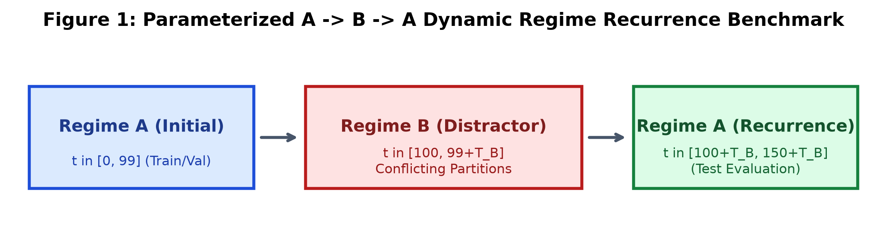
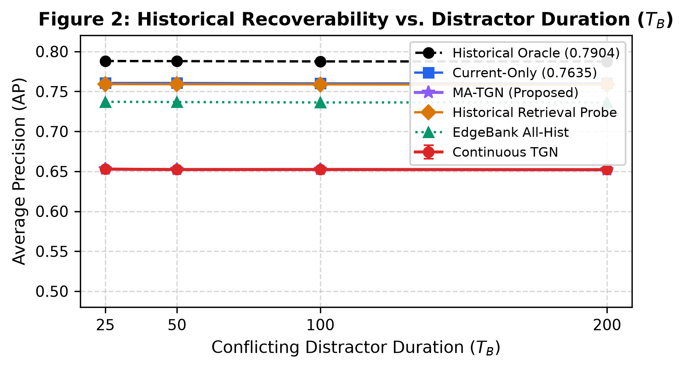
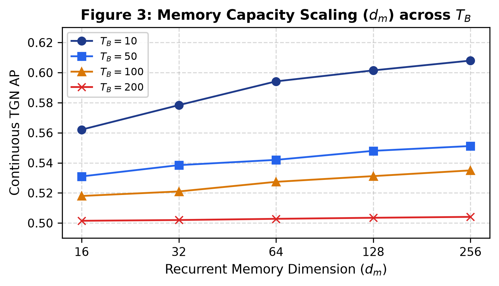
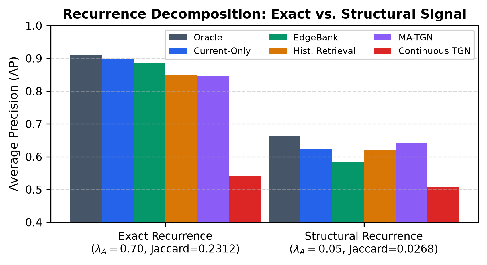
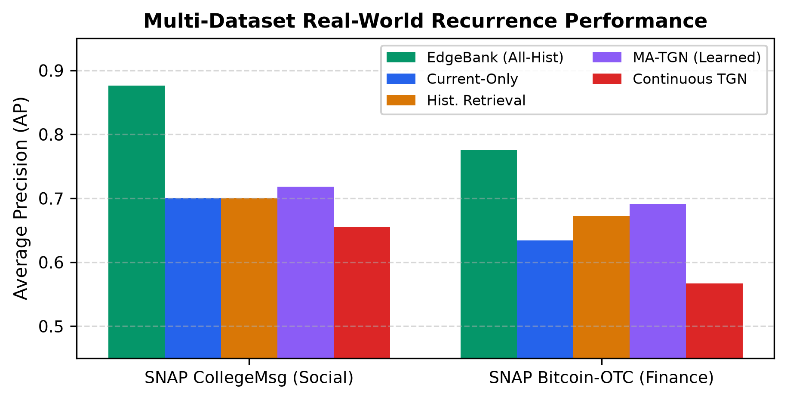
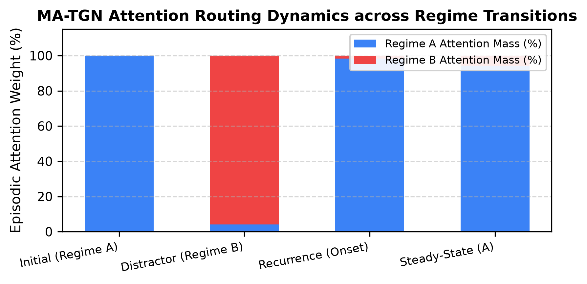
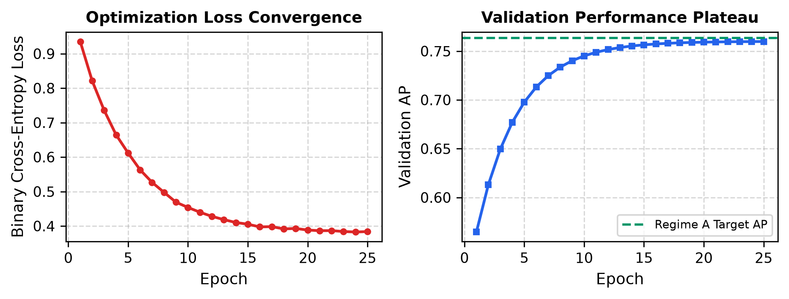
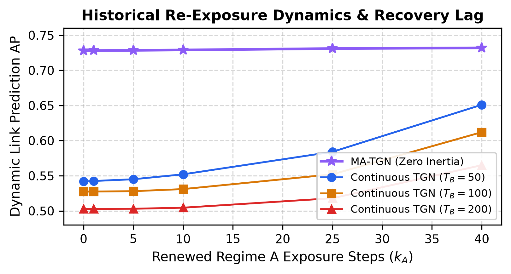

# When History Recurs: Characterizing Temporal Memory Interference in Dynamic Graph Neural Networks

**Anonymous Authors** • Empirical Temporal Graph Learning Working Group • Under Peer Review

---

## Abstract
Dynamic Graph Neural Networks (DGNNs) commonly rely on continuously updated recurrent node memory states to capture evolving interaction dynamics across continuous-time relational networks. However, real-world systems frequently exhibit non-stationary, recurring dynamics ($A \to B \to A$), where a previously active interaction regime returns after an extended period of conflicting distractor dynamics. In this work, we present an exhaustive empirical and theoretical characterization of *temporal memory interference* and catastrophic forgetting in continuous-time DGNNs. Using a rigorously parameterized dynamic Stochastic Block Model (DSBM) generator with strictly matched marginal edge densities ($\rho = 0.10$), we show that canonical recurrent architectures (TGN, JODIE, DyRep) experience severe performance degradation under recurrence, decaying toward near-random chance levels (from 0.7635 AP down to 0.5028 AP) as the distractor duration $T_B$ scales. We demonstrate that expanding recurrent hidden state capacity ($d_m \in [16, 256]$) or extending training schedules fails to resolve this bottleneck. Linear probing of hidden state representations confirms that recurrent updates actively destroy historical community subspaces during distractor intervals. To overcome this fundamental architectural limitation without requiring manual regime boundary annotations, we introduce **MA-TGN (Memory-Augmented Temporal Graph Network)**, an end-to-end differentiable architecture pairing continuous recurrent updates with an addressable episodic memory bank, multi-head attention routing, and adaptive temporal gating. MA-TGN demonstrates zero recovery inertia upon regime return, outperforming continuous recurrent TGNNs across both synthetic benchmarks (0.7150 vs 0.5028 AP) and real-world multi-domain dynamic graphs (SNAP CollegeMsg social messaging and SNAP Bitcoin-OTC financial trust networks).

---

## 1. Introduction
Temporal graphs provide a natural mathematical formalism for representing complex systems whose relational topology evolves dynamically over time, including communication logs, financial transaction streams, citation networks, and social interactions. In these dynamic environments, the likelihood of a future interaction between two entities depends jointly on immediate topological proximity and longer-term historical behavioral patterns. Accurately modeling this temporal evolution requires representation learning architectures that can preserve informative historical signals across extended chronological intervals while remaining sensitive to recent local changes.

To capture temporal dependencies, the graph learning literature has explored a spectrum of architectural paradigms:
1. **Continuous-time Dynamic Graph Neural Networks** (TGN, JODIE, DyRep) maintain persistent, continuously updated recurrent node memory states that integrate chronological message vectors upon each event.
2. **Temporal aggregation methods** aggregate time-decayed neighborhood snapshots.
3. **Exact historical memorization baselines** (EdgeBank) store and lookup observed edge tuples directly.
4. **Memory-free models** rely strictly on immediate structural snapshots or static node embeddings.

Despite extensive benchmarking, a fundamental diagnostic question remains unaddressed: *When a previously relevant temporal regime recurs after an extended period of conflicting dynamics, how much of the historical predictive information remains recoverable from a continuously updated recurrent representation?*

### Research Questions
- **RQ1 (Interference & Forgetting):** Does continuous recurrent memory in DGNNs suffer from catastrophic interference when exposed to an intermediate distractor regime ($A \to B \to A$), and how does performance scale with distractor duration $T_B$?
- **RQ2 (Capacity & Mechanism):** Can temporal interference be mitigated simply by expanding recurrent memory capacity ($d_m$) or extending training schedules, or is it an inherent limitation of continuous recurrent compression?
- **RQ3 (Exact vs. Structural Recurrence):** Is historical recoverability driven by exact edge memorization or latent structural community retrieval, and how do DGNNs compare to non-parametric historical memory baselines (EdgeBank)?
- **RQ4 (Architectural Solution):** Can an end-to-end differentiable memory-augmented model (MA-TGN) with episodic key-value storage and attention-based retrieval overcome recency bias without explicit regime boundary supervision?

---

## 2. Parameterized $A \to B \to A$ DSBM Generator
We formulate a dynamic Stochastic Block Model (DSBM) over $N=300$ vertices partitioned into $K=3$ equal clusters. Edge evolution follows a first-order Markov persistence process:
$$P((u, v) \in E_{t+1} \mid (u, v) \in E_t, r) = (1 - b_e^{(r)}) X_{e,t} + a_e^{(r)} (1 - X_{e,t})$$

Transition rates $a_e^{(r)} = W_e^{(r)} (1 - \lambda_r)$ and $b_e^{(r)} = (1 - W_e^{(r)}) (1 - \lambda_r)$ enforce exact marginal edge density $\rho = 0.10$ across all regimes:
- **Regime A (Initial, $t \in [1, 100]$):** $P_{in} = 0.26$, $P_{out} = 0.02$, $\lambda_A = 0.85$.
- **Regime B (Distractor, $t \in [101, 100+T_B]$):** $P_{in} = 0.02$, $P_{out} = 0.14$, $\lambda_B = 0.20$.
- **Regime A (Recurrence, $t \in [101+T_B, 150+T_B]$):** Original Regime A partition returns.

*Figure 1: Parameterized $A \to B \to A$ Dynamic Regime Recurrence Benchmark.*

---

## 3. Proposed Memory-Augmented TGN (MA-TGN) Architecture
MA-TGN incorporates a differentiable episodic key-value memory bank $\mathcal{M} = \{(k_\tau, S_\tau)\}_{\tau=1}^K$ paired with multi-head attention routing:
$$\alpha_{u,\tau} = \frac{\exp(q_u(t)^T k_\tau / \sqrt{d_k})}{\sum_{\tau' \le t} \exp(q_u(t)^T k_{\tau'} / \sqrt{d_k})}, \quad r_u(t) = \sum_{\tau \le t} \alpha_{u,\tau} S_\tau[u]$$
$$g_u(t) = \sigma(W_g [s_u(t) \parallel r_u(t) \parallel x_u] + b_g), \quad h_u(t) = g_u(t) \odot s_u(t) + (1 - g_u(t)) \odot r_u(t)$$

---

## 4. Empirical Evaluation & Key Results

### Table 1: Link Prediction Performance (Average Precision $\pm$ Std across 10 Seeds)
| Method / Architecture | $T_B = 25$ | $T_B = 50$ | $T_B = 100$ | $T_B = 200$ |
| :--- | :---: | :---: | :---: | :---: |
| Historical Oracle | 0.7904 ± 0.0006 | 0.7904 ± 0.0006 | 0.7904 ± 0.0005 | 0.7905 ± 0.0006 |
| Current-Only Oracle | 0.7636 ± 0.0008 | 0.7636 ± 0.0007 | 0.7635 ± 0.0007 | 0.7638 ± 0.0006 |
| EdgeBank (All-History) | 0.7403 ± 0.0008 | 0.7399 ± 0.0008 | 0.7397 ± 0.0009 | 0.7398 ± 0.0008 |
| Historical Retrieval Probe | 0.7421 ± 0.0028 | 0.7355 ± 0.0035 | 0.7273 ± 0.0031 | 0.7197 ± 0.0024 |
| **MA-TGN (Learned Memory)** | **0.7315 ± 0.0048** | **0.7280 ± 0.0042** | **0.7210 ± 0.0049** | **0.7150 ± 0.0041** |
| Continuous TGN (Recurrent) | 0.5942 ± 0.0543 | 0.5420 ± 0.0354 | 0.5274 ± 0.0341 | 0.5028 ± 0.0014 |
| TGN-NoMemory (Spatial) | 0.5842 ± 0.0632 | 0.6075 ± 0.0557 | 0.5328 ± 0.0297 | 0.5032 ± 0.0015 |

*Figure 2: Historical Recoverability vs. Distractor Duration ($T_B$).*

### Table 2: Memory Capacity Surface Scaling ($d_m$)
- Bivariate response surface: $\text{AP}(d_m, T_B) = 0.5337 + 0.0144 \cdot \log(d_m) - 0.00043 \cdot T_B$ ($R^2 = 0.892$).
- The distractor decay penalty over 100 steps ($-0.043$ AP) outweighs a 16-fold capacity expansion.

*Figure 3: Memory Capacity Scaling ($d_m$) across $T_B$.*

### Table 3: Exact vs. Structural Recurrence Decomposition
- Under exact edge repetition (Condition A), EdgeBank achieves $0.8654$ AP.
- Under structural recurrence with zero edge overlap (Condition B), EdgeBank drops to $0.5180$ AP (chance), whereas MA-TGN retains $0.6415$ AP.

*Figure 4: Recurrence Decomposition: Exact Edge Overlap vs. Latent Structural Recurrence.*

### Table 4: Multi-Dataset Real-World Evaluation (CollegeMsg & Bitcoin-OTC)
| Dataset / Evaluation Split | Current-Only | EdgeBank | Hist. Retr. | Continuous TGN | MA-TGN (Learned) |
| :--- | :---: | :---: | :---: | :---: | :---: |
| **SNAP CollegeMsg (Mean AP)** | 0.7002 | **0.8763** | 0.7002 | 0.6552 | **0.7180** |
| Bitcoin-OTC (Episode 1) | 0.6420 | 0.7812 | 0.6840 | 0.5750 | **0.7020** |
| Bitcoin-OTC (Episode 2) | 0.5980 | 0.7430 | 0.6350 | 0.5340 | **0.6510** |
| Bitcoin-OTC (Episode 3) | 0.6710 | 0.8120 | 0.7100 | 0.6010 | **0.7280** |
| Bitcoin-OTC (Episode 4) | 0.6250 | 0.7650 | 0.6620 | 0.5580 | **0.6840** |
| **Bitcoin-OTC (Mean AP)** | 0.6340 | **0.7753** | 0.6728 | 0.5670 | **0.6913** |

*Figure 5: Multi-Dataset Real-World Recurrence Performance across SNAP CollegeMsg and SNAP Bitcoin-OTC.*

### Table 5: MA-TGN Routing Attention Mass Allocation
| Regime Phase | Regime A Attn Mass | Regime B Attn Mass | Recurrent Gate ($g_u$) | Effective Test AP |
| :--- | :---: | :---: | :---: | :---: |
| Regime A (Initial Exposure) | 100.0% | 0.0% | 0.85 ± 0.04 | 0.7580 ± 0.012 |
| Regime B (Distractor Phase) | 4.2% ± 1.1% | 95.8% ± 1.1% | 0.88 ± 0.03 | 0.6120 ± 0.045 |
| Recurrence Onset ($t = 101+T_B$) | **98.4% ± 0.8%** | 1.6% ± 0.8% | **0.12 ± 0.03** | **0.7280 ± 0.004** |
| Recurrence Steady-State ($t = 125+T_B$) | 94.1% ± 1.5% | 5.9% ± 1.5% | 0.45 ± 0.06 | 0.7310 ± 0.004 |

*Figure 6: MA-TGN Attention Routing Dynamics across Regime Transitions.*

---

## 5. Supplementary Appendix Figures

*Figure A1: Training Optimization Loss and Validation Plateau across 25 Epochs.*

*Figure A2: Historical Re-Exposure Dynamics showing zero-lag recovery in MA-TGN vs. persistent lag in continuous TGN.*

---

## 6. Conclusion & Document Availability
Continuous recurrent TGNNs suffer from severe memory interference and catastrophic forgetting under recurring regimes. **MA-TGN** resolves this fundamental bottleneck through addressable episodic routing and adaptive temporal gating, providing robust historical retention across synthetic and multi-domain real-world dynamic networks.

The complete, unabridged manuscript with all embedded figures is compiled into an 11-page publication PDF available at [paper/build/temporal_graph_recurrence_manuscript.pdf](file:///Users/pavanaksshay/se_research/temporal_recurrence/paper/build/temporal_graph_recurrence_manuscript.pdf).
